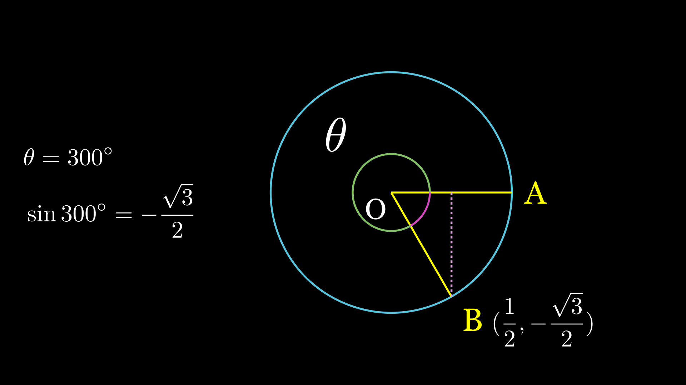
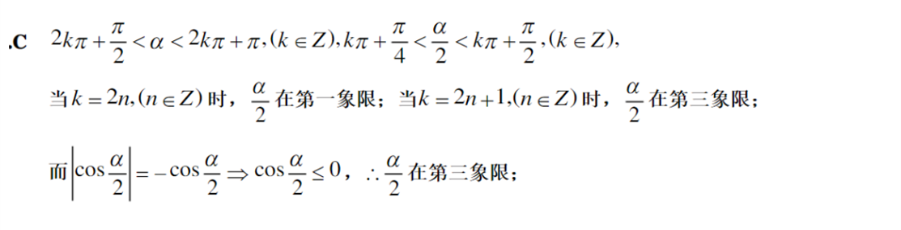

## 视频思考题

1. 请问$\sin{300^\circ}$的值是多少？

2. 请问$\sin{(\theta + \dfrac{k\pi}{2})}=$_____？$(k为整数，答案用\theta表示)$

提示：诱导公式的目的是什么呢？就是将$\sin{(\dfrac{k\pi}{2}+\theta)}$中的整数倍$k$去掉，仅保留$\theta$。我们将$\theta$看成一个锐角，然后假设$\dfrac{k\pi}{2}+\theta$的终边落在哪个象限，这时候就容易得到结果了。
如果你没有想明白，那么请记住 **"奇变偶不变，符号看象限"**

3. 请问$\tan{\dfrac{\pi}{2}}$能取到吗？如果取不到，那么为什么取不到？

提示：从定义出发，我们知道$\tan{\theta}=\dfrac{\sin{\theta}}{\cos{\theta}}$，那么当$\theta=\dfrac{\pi}{2}$时，$\sin{\dfrac{\pi}{2}}=1$，$\cos{\dfrac{\pi}{2}}=0$，$\dfrac{1}{0}$是不允许的，所以$\tan{\dfrac{\pi}{2}}$是取不到的。对于任意角的情况，其实也是一致的。

## 弧度制

1. 如果$1$弧度的圆心角所对的弦长为$2$，那么这个圆心角所对的弧长为(&emsp;)  

&emsp; $A.\dfrac{1}{\sin{0.5}}$ &emsp;&emsp; $B.\sin{0.5}$ &emsp; $C. 2\sin{0.5}$ &emsp;&emsp;$D.\tan{0.5}$

&emsp;答案：A
&emsp;*提示*：连接圆心与弦的中点，则得到一个弦一半所对的角是$1$弧度的角。

2. &nbsp; $3$弧度的角的终边在第___象限，7弧度的角的终边在第___象限。

&emsp;答案：二 ; 一
&emsp;*提示*：$\dfrac{\pi}{2}<3<\pi$，$2\pi<7<\dfrac{5\pi}{2}$

## 三角函数的性质

1. 设$\theta$分别是第二、三、四象限的角，则点$P(\sin{\theta},\cos{\theta})$分别在第___、___、___象限。

&emsp;答案：四 ; 三 ; 二
&emsp;*提示*：$\sin{\theta}$是纵坐标，$\cos{\theta}$是横坐标。判断正负即可，不要被吓到。

2. 设$\alpha$角属于第二象限，且$|\cos{\dfrac{\alpha}{2}}|=-\cos{\dfrac{\alpha}{2}}$，则$\dfrac{\alpha}{2}$属于(&emsp;)

&emsp; $A.$第一象限 &emsp;&emsp; $B.$第二象限 &emsp; $C.$第三象限 &emsp;&emsp;$D.$第四象限

&emsp;答案：C

## 三角函数的计算

1. 已知$\tan{x}=2$，求$\dfrac{\cos{x}+\sin{x}}{\cos{x}-\sin{x}}$的值。

&emsp;答案：
&emsp;原式$=\dfrac{1+\tan{x}}{1-\tan{x}}=-3$

2. $\sin{(-\dfrac{19}{6}\pi)}$的值。

&emsp;答案：
&emsp;原式$=-\sin{(-\dfrac{19}{6}\pi+3\pi)}=-\sin{(-\dfrac{\pi}{6})}=\dfrac{1}{2}$